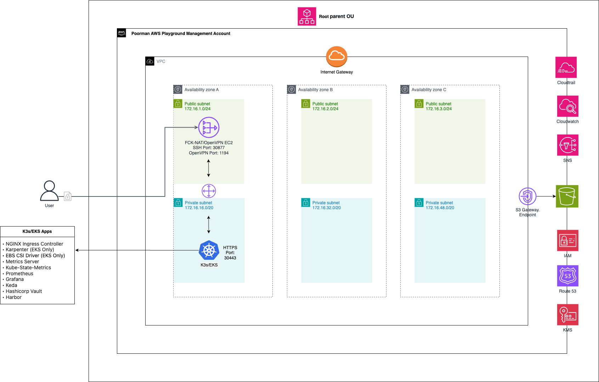
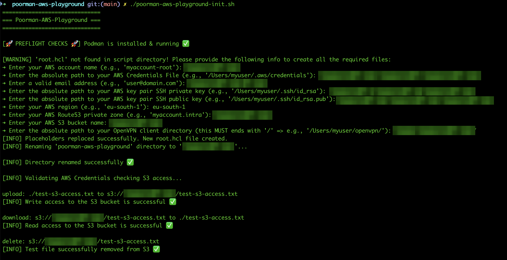
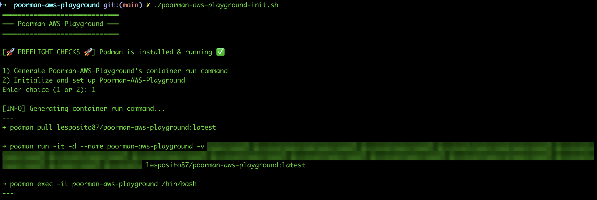
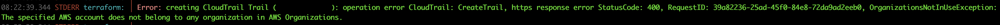
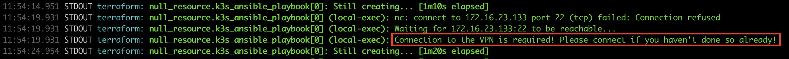
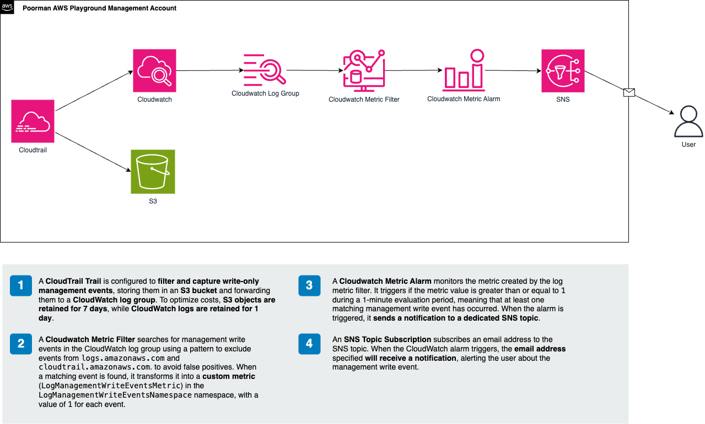
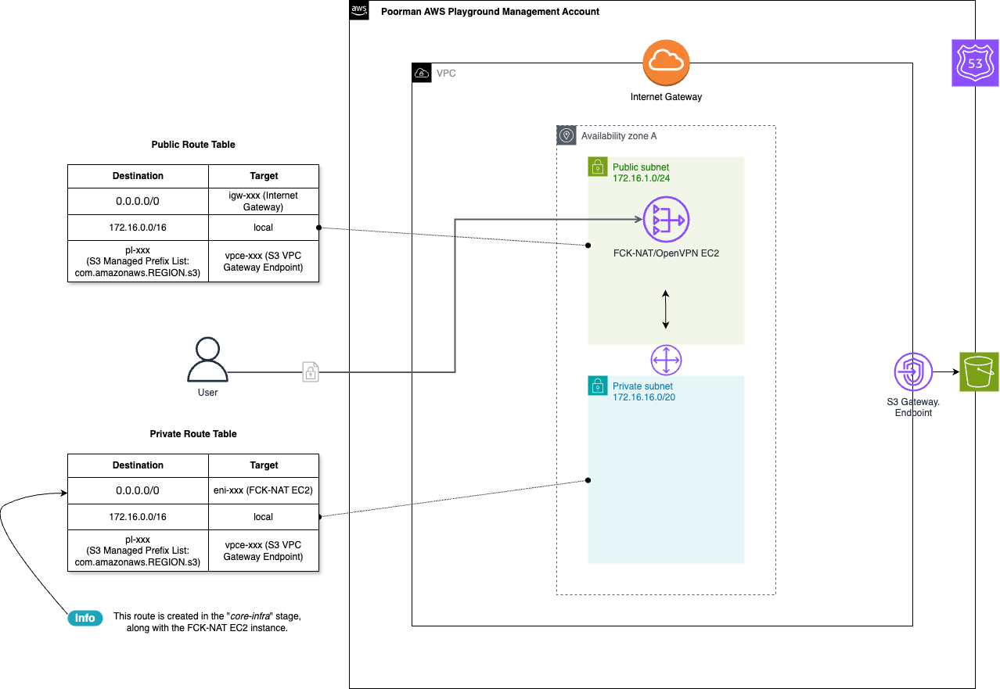
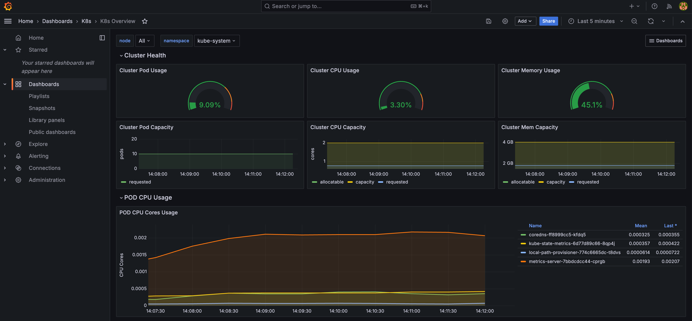
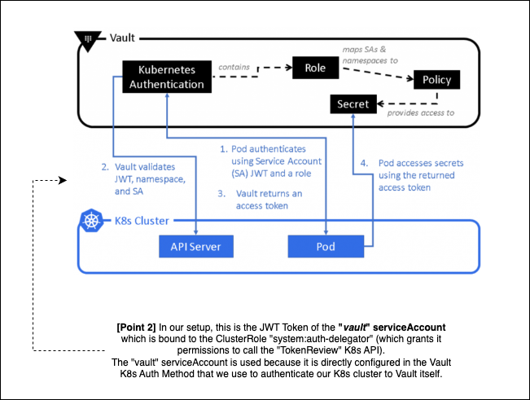

# Poorman AWS Playground


## Table of Contents

- [Project Description](#projectdescription)
- [Prerequisites](#prerequisites)
- [How to Run it?](#howtorunit)
- [Project Structure & Infrastructure Details](#projectstructure)
  - [`organizations`](#organizations)
  - [`networking`](#networking)
    - [Overview](#networkingoverview)
    - [FCK-NAT AMI](#fcknatami)
  - [`core-infra`](#coreinfra)
    - [FCK-NAT EC2 Instance & OpenVPN Client files](#fcknatec2)
    - [K3s](#k3s)
    - [EKS](#eks)
  - [`k8s-core-apps`](#k8scoreapps)
    - [NGINX Ingress Controller](#nginxingresscontroller)
    - [Karpenter](#karpenter)
    - [EBS CSI Driver](#ebscsidriver)
  - [`k8s-monitoring`](#k8smonitoring)
    - [Metrics Server](#metricsserver)
    - [Kube-State-Metrics](#kubestatemetrics)
    - [Prometheus](#prometheus)
    - [Grafana](#grafana)
    - [Keda](#keda)
  - [`k8s-ci-cd`](#k8scicd)
    - [HashiCorp Vault](#vault)
    - [Harbor](#harbor)

<br>

## Project Description <a name="projectdescription"/>

The goal of this project is to provide a fully automated way to **spin up an AWS playground environment** using [Terragrunt](https://terragrunt.gruntwork.io/), [Packer](https://www.packer.io/), and [Ansible](https://docs.ansible.com/) as Infrastructure as Code (IaC) tools.

This setup allows you to start exploring some of the most widely used AWS services & technologies/products like [Karpenter](https://karpenter.sh/), [Keda](https://keda.sh/), [Hashicorp Vault](https://developer.hashicorp.com/vault), [Harbor](https://goharbor.io/), [Prometheus](https://prometheus.io/), [Grafana](https://grafana.com) etc... with minimal effort.

As the name suggests, this project is designed with **cost efficiency** in mind. Since I want to spend as little money as possible, one of the key objectives is to minimize AWS expenses while maintaining a functional environment. 

To achieve this, here are some decisions that have been made:

- **Single Availability Zone Deployment**: All compute resources are deployed in a single AZ to avoid costly **cross-AZ data transfer fees**.
- **Custom NAT Solution**: Instead of using AWS's NAT Gateway, which incurs high costs, this setup replaces it with a **FCK-NAT EC2 instance** that acts as both a **NAT gateway** and an **OpenVPN server** ([fck-nat official documentation](https://fck-nat.dev/stable/)).
- **Spot Instances** usage (only for instances created with [Karpenter](https://karpenter.sh/))
- **Cost Monitoring & Alerts**:
  - **AWS Budgets** is configured to **send alerts** if the monthly forecasted cost exceeds the defined threshold (**default: $20**).
  - **CloudWatch Alarms** notify you whenever a **ManagementWriteEvent** occurs ensuring you're alerted if someone other than you is making changes to your AWS environment.

⚠️ This project is intended for educational and testing purposes only. It is NOT designed or optimized for running Production workloads.

<br>

Here is an high-level diagram illustrating the AWS account configuration and the AWS managed-services involved:



<br>

## Prerequisites <a name="prerequisites"/>

- An AWS account with:
  - An **IAM user** that has the `AdministratorAccess` policy attached, along with **Access Keys** stored locally in the following format (used to configure the Terraform AWS provider):
    ```
    ➜  ~ cat ~/.aws/poorman-aws-playground
    [default]
    aws_access_key_id     = <MY_ACCESS_KEY>
    aws_secret_access_key = <MY_SECRET_ACCESS_KEY>
    ```
  - An **S3 bucket** for storing Terraform state files and CloudTrail events
- A valid **email address** to receive AWS Budget and CloudWatch alerts
- An **SSH key pair** for connecting to EC2 instances and post-provisioning with Ansible
- An **OpenVPN client** installed on your machine (e.g., Tunnelblick)
- Either **Podman** or **Docker** running on your machine

<br>

## How to Run it? <a name="howtorunit"/>

**1-** Clone this repository locally and run the `poorman-aws-playground-init.sh` script, providing all the required information. 

This will generate a new `root.hcl` file and a directory named according to the value provided for the `Enter your AWS account name` option during the execution of the `poorman-aws-playground-init.sh` script (e.g. `myaccount-root`). The directory will contain all the code required to deploy your infrastructure.

⚠️ Ensure the **S3 bucket** you specify in the `Enter your AWS S3 bucket name` option is located in the **same region** as the one you enter in the `Enter your AWS region` option:



**2-** Run the `poorman-aws-playground-init.sh` script again and choose **Option 1** (`Generate Poorman-AWS-Playground's container run command`):



**3-** Execute the 3 `docker`/`podman` commands generated in the previous step to enter the `poorman-aws-playground` container.

**4-** Navigate into each project folder and run the `terragrunt apply` command to deploy the infrastructure.

<br>

ℹ️ All the variables used to deploy your infrastructure are centralized in the **`root.hcl`** file. If you need to customize any values, simply edit this file and re-run the `terragrunt apply` commands.

⚠️ **Deploy the components in the following order** to ensure dependency resolution:

1. `organizations`
2. `networking`
3. `core-infra`
4. `k8s-core-apps`
5. `k8s-monitoring` & `k8s-ci-cd`

<br>

## Important Notes

⚠️ In case you encounter the following error during the `organizations` stage, just re-run the `terragrunt apply` command:



<br>

⚠️ During the `core-infra` stage, **the VPN must be active to deploy the `K3s` node**.

Make sure to activate it (using the `client.conf` file automatically generated in the directory specified by the `ansible_openvpn_client_dir` variable) when you see the following message in the Terragrunt execution logs:



Ensure that the **`10.8.0.0/24`** subnet, used by the OpenVPN service running on our `fck-nat` instance, **does NOT overlap with any existing networks** on your side (e.g. local Wi-Fi, Docker networks, corporate LANs etc...)

<br>

⚠️ During the `core-infra` stage, if you need to **destroy the `fck-nat` instance** and the destroy task hangs with the following message, **ensure that your VPN is disconnected**:
```
07:31:24.178 STDOUT terraform: module.fck_nat.aws_instance.main[0]: Still destroying... [id=i-09b017f4e7f8437ca, 3m0s elapsed]
```

<br>

⚠️ During the `core-infra` stage, if you need to **recreate the `fck-nat` instance**, make sure to:

- Disconnect from the VPN (if currently connected)

- Allow the instance to be fully recreated

- Reconnect to the VPN using the updated `client.conf`, which is automatically generated during the instance recreation

<br>

⚠️ During the `k8s-core-apps`, `k8s-monitoring` & `k8s-ci-cd` stages, **the VPN must be active** to deploy all the components.

<br>


## Project Structure & Infrastructure Details <a name="projectstructure"/>

This project is organized into multiple folders, with each folder responsible for deploying specific components of the infrastructure.

### `organizations` <a name="organizations"/>

This folder contains code that sets up a complete monitoring and alerting pipeline for AWS resource changes. It leverages **CloudTrail** to log management events, forwards them to **CloudWatch** for analysis, and triggers alarms and email notifications via **SNS** whenever a ManagementWriteEvent occurs. Additionally, it configures **AWS Budgets** to monitor cost overruns and enables **AWS Organizations** for centralized management allowing you to seamlessly add additional accounts in the future if needed:



<br>

---

### `networking` <a name="networking"/>

#### Overview <a name="networkingoverview"/>

This folder contains code that provisions a **VPC** with **Public and Private subnets** (along with their associated **Route Tables**), sets up a **VPC S3 Gateway Endpoint** for private access to S3 without requiring an Internet or NAT Gateway, and creates a **Private Route 53 DNS zone**:



<br>

#### 🚀 FCK-NAT AMI 🚀 <a name="fcknatami"/>

A custom private AMI built with **Packer**, based on the latest `fck-nat-al2023-*arm64*` public AMI. The main customizations include:

- Custom SSH port (defined in the variable `fck_nat_ssh_custom_port`, default: `30877`)
- Updating OS packages to the latest available versions
- Ensuring `PermitRootLogin` and `PasswordAuthentication` are disabled in SSH configuration
- Adding a cronjob to dynamically retrieve the EKS kubeconfig for our EKS cluster

ℹ️ After the initial deployment (which requires at least one instance of this AMI), you can disable the AMI rebuild setting the variable `packer_build_ami` to `false` (file `root.hcl` ➜ automatically generated after executing the script `poorman-aws-playground-init.sh`).

<br>

#### 🚀 EC2 Key Pair 🚀

A Key Pair used to access the FCK-NAT & K3s EC2 instances, created from the variables `aws_key_pair_private` and `aws_key_pair_public`.

<br>

---

### `core-infra` <a name="coreinfra"/>

⚠️ This stage depends on the `networking` one, so ensure the networking resources are deployed first.

ℹ️ All the nodes will be deployed in a **single Availability Zone** (defined in the variable `vpc_primary_az`).

This folder contains code that provisions the following components:

<br>

#### 🚀 FCK-NAT EC2 Instance & OpenVPN Client files 🚀 <a name="fcknatec2"/>

An On-Demand EC2 instance serving as both a NAT Gateway and an OpenVPN Server. The OpenVPN configuration is managed using the **Ansible** role [ansible-role-openvpn](https://github.com/lesposito87/ansible-role-openvpn).

The default **instance type** for this EC2 is `t4g.nano`, but it can be customized using the `ec2_fck_nat_instance_type` variable.

ℹ️ **This instance is publicly accessible only from the IP address of the user executing the Terragrunt commands**. 

The home IP is dynamically retrieved during deployment using these resources:
```
data "http" "home_ip" {
  url = "https://ifconfig.me/ip"
}

locals {
  home_ip = trimspace(data.http.home_ip.response_body)
}
```

Access is restricted to:

- **SSH** on the custom port defined in the variable `fck_nat_ssh_custom_port` (default: `30877` => accessible only using the SSH private key defined in the variable `aws_key_pair_private`)
  - Use this command to SSH into the instance: `ssh -i <aws_key_pair_private> ec2-user@<FCK-NAT-Public-IP> -P 30877`

- **OpenVPN** on port `1194` (using the `client.conf` file automatically generated on the directory defined in the variable `ansible_openvpn_client_dir`)

ℹ️ **This instance also has read-only access to the EKS cluster**, allowing it to perform diagnostics in case of VPN issues.
This is possible thanks to the following EKS access entry:
```
  access_entries = {
    ...
    fck_nat_read_access = {
      kubernetes_groups = []
      principal_arn     = "arn:aws:iam::${data.aws_caller_identity.current.account_id}:role/fck-nat-${var.vpc_primary_az}" # => FCK-NAT IAM Role
      policy_associations = {
        example = {
          policy_arn = "arn:aws:eks::aws:cluster-access-policy/AmazonEKSViewPolicy"
          access_scope = {
            type = "cluster"
          }
        }
      }
    }
  }
```

Additionally, **`kubectl`** is pre-installed and readily available.

<br>

#### 🚀 K3s & Kubeconfig 🚀 <a name="k3s"/>

A privately accessible **K3s cluster** (deployed on a single On-Demand EC2 instance) dedicated to running all the Kubernetes workloads described in the following sections.

The K3s configuration is managed using the **Ansible** role [ansible-role-k3s](https://github.com/lesposito87/ansible-role-k3s).

As outlined in the [Official Documentation](https://docs.k3s.io/storage), _K3s comes with Rancher's **Local Path Provisioner** and this enables the ability to create **persistent volume claims** out of the box using local storage on the respective node_; so if you need more space for your PVCs, just increase the EC2 instance's disk size and resize the filesystem accordingly.


ℹ️ The default **instance type** for this instance is `t4g.medium`, but it can be customized using the `ec2_k3s_instance_type` variable.

ℹ️ If you prefer to run your Kubernetes workloads on [EKS](https://aws.amazon.com/eks/), set the `eks_deploy` variable to `true` (default is `false` ➜ :dollar: Be aware of the [costs](https://calculator.aws/#/createCalculator/EKS)! :dollar:).

A **Kubeconfig** file will be automatically generated after the K3s deployment and stored at the path specified in the `kubeconfig_local_file` variable.

<br>

#### 🚀 EKS Cluster, OpenID Connect (OIDC) Provider & Kubeconfig 🚀 <a name="eks"/>

⚠️ These components will only be deployed if the `eks_deploy` variable is set to `true` (default is `false`). This is because EKS is not cheap at all for a playground environment, so by default, a single-node [K3s](https://k3s.io/) setup is used instead.

<br>

A privately accessible **EKS cluster** with a single **`core` managed node group**, consisting of **1 On-Demand node**, dedicated to deploying core components such as CoreDNS, kube-proxy, VPC CNI, NGINX Ingress Controller and so on...

ℹ️ The default **instance type** for this `core` node is `t4g.medium`, but it can be customized using the `eks_core_instance_type` variable.

This `core` node is configured with the following **Taint** and Label to ensure that only core applications (described in the next section) can run on it, by applying the appropriate Tolerations and nodeSelector settings.
```
      labels = {
        role = "core"
      }
      taints = [
        {
          key    = "role"
          value  = "core"
          effect = "NO_SCHEDULE"
        }
      ]
``` 

A **Kubeconfig** file will be automatically generated after the EKS deployment and stored at the path specified in the `kubeconfig_local_file` variable.

ℹ️ In order to run **`kubectl`** commands (and properly connect to the EKS APIs), make sure to export the variable `AWS_SHARED_CREDENTIALS_FILE` (with the value defined in the variable `aws_shared_credentials_file`):
```
poorman@24025eaf499f:~$ export AWS_SHARED_CREDENTIALS_FILE=/Users/myuser/.aws/my-aws-credentials

poorman@24025eaf499f:~$ kubectl get nodes
NAME                                          STATUS   ROLES    AGE     VERSION
ip-172-16-28-60.eu-south-1.compute.internal   Ready    <none>   6m42s   v1.32.1-eks-5d632ec
```

<br>

An **OpenID Connect(OIDC) Provider** that is used to securely connect our Kubernetes Service Account with an AWS IAM role. This allows our pods to assume an IAM role and access AWS services like S3 without needing AWS credentials directly inside the pods.

Here's an example of IAM Role (`karpenter-controller`) that enables our Kubernetes pods to securely access AWS services by assuming the role through the `ServiceAccount`, inheriting the permissions specified in a IAM Policy attached to the IAM Role itself:
```
### IAM Role Trusted Entities (Entities that can assume this role under specified conditions) ###

{
   "Version":"2012-10-17",
   "Statement":[
      {
         "Effect":"Allow",
         "Principal":{
            "Federated":"arn:aws:iam::<AWS-ACCOUNT-ID>:oidc-provider/oidc.eks.<AWS-REGION>.amazonaws.com/id/88EFE8A9E3F9C27Y7FDE4A252786FUR8"
         },
         "Action":"sts:AssumeRoleWithWebIdentity",
         "Condition":{
            "StringEquals":{
               "oidc.eks.<AWS-REGION>.amazonaws.com/id/88EFE8A9E3F9C27Y7FDE4A252786FUR8:sub":"system:serviceaccount:kube-system:karpenter",
               "oidc.eks.<AWS-REGION>.amazonaws.com/id/88EFE8A9E3F9C27Y7FDE4A252786FUR8:aud":"sts.amazonaws.com"
            }
         }
      }
   ]
}

### Kubernetes Service Account (map "karpenter" serviceAccount with "karpenter-controller" IAM Role) ###

poorman@24025eaf499f:~$ kubectl get sa karpenter -n kube-system -o yaml
apiVersion: v1
kind: ServiceAccount
metadata:
  annotations:
    eks.amazonaws.com/role-arn: arn:aws:iam::<AWS-ACCOUNT-ID>:role/karpenter-controller
```

<br>

---

### `k8s-core-apps` <a name="k8scoreapps"/>

⚠️ This stage depends on the `core-infra` one, so make sure to deploy it first.

⚠️ **This stage also requires the VPN to be active**. Connect to it using the `client.conf` file, which is automatically generated during the `core-infra` stage (within the folder defined in the variable `ansible_openvpn_client_dir`).

This folder contains code that provisions the following components:

<br>

#### 🚀 NGINX Ingress Controller 🚀 <a name="nginxingresscontroller"/>

This setup deploys an NGINX Ingress Controller using a **NodePort** service type, which means that external traffic can reach the ingress controller through a specific port on the Kubernetes nodes (Kubernetes will allocate a port on each node to expose the service).

By default, the NodePort is set to **`30443`** (configured via the `k8s_nginx_https_host_port` variable).

ℹ️ This setup was chosen to avoid the cost of a Network Load Balancer.

A **Route53 A Record** `k8s-nginx-ingress-controller.<R53-PRIVATE-ZONE>` is automatically created, pointing to the private IP address of the `K3S` instance or, if `EKS` is deployed, to the private IP address of the EKS `core` node.

⚠️ Since we’re minimizing costs, we’re not using a valid TLS certificate for the NGINX Ingress Controller. Instead, we rely on the default **self-signed certificate** provided by the controller:
```
poorman@24025eaf499f:~$ curl -k -I -L https://k8s-nginx-ingress-controller.myaccount.intra:30443 -v
* Host k8s-nginx-ingress-controller.myaccount.intra:30443 was resolved.
...
* Connected to k8s-nginx-ingress-controller.myaccount.intra (172.16.28.60) port 30443
...
* Server certificate:
*  subject: O=Acme Co; CN=Kubernetes Ingress Controller Fake Certificate
```

<br>

#### 🚀 Karpenter 🚀 <a name="karpenter"/>

⚠️ This component will only be deployed with EKS (`eks_deploy` variable set to `true` - default is `false`).

As outlined in the [Official Documentation](https://karpenter.sh/docs/), _Karpenter is an open-source node lifecycle management project built for Kubernetes. Adding Karpenter to a Kubernetes cluster can dramatically improve the efficiency and cost of running workloads on that cluster_.

This setup deploys the Karpenter Controller with a default NodePool and NodeClass, enabling **cluster autoscaling** with **Spot Only Instances** to reduce costs.

**NodePool** sets constraints on the nodes that can be created by Karpenter and the pods that can run on those nodes. 

The NodePool can be set to do things like:

- Define taints to limit the pods that can run on nodes Karpenter creates:
  ```
    spec:
      taints:
        - effect: NoSchedule
          key: karpenter
          value: schedule
  ```
- Limit node creation to certain AZs, instance types, and computer architectures:
  ```
    spec:
      requirements:
        - key: "topology.kubernetes.io/zone"
          operator: In
          values: [${local.karpenter_az[var.vpc_primary_az].name}]
        - key: karpenter.sh/capacity-type
          operator: In
          values:
            - spot
        - key: karpenter.k8s.aws/instance-hypervisor
          operator: In
          values:
            - nitro
        - key: kubernetes.io/arch
          operator: In
          values:
            - amd64
            - arm64
        - key: karpenter.k8s.aws/instance-family
          operator: In
          values: ${jsonencode(local.karpenter_instance_family)}
        - key: karpenter.k8s.aws/instance-size
          operator: In
          values: ${jsonencode(local.karpenter_instance_size)}
        - key: kubernetes.io/os
          operator: In
          values:
            - linux
  ```

ℹ️ You can review and customize the applied settings in the [karpenter-nodepool-default.tf](https://github.com/lesposito87/poorman-aws-playground/blob/main/lesposito87-root/k8s-core-apps/karpenter-nodepool-default.tf) file.

<br>

**NodeClass** enables configuration of AWS specific settings. 
Each NodePool must reference an EC2NodeClass using `spec.template.spec.nodeClassRef`. 
Multiple NodePools may point to the same EC2NodeClass.

The NodeClass can be set to do things like:

- Discovers subnets in which create instances
- Discovers security groups to attach to instances
- Discovers AMI to use
- Define the IAM role to attach to instances
```
spec:
  amiFamily: AL2023
  role: "${aws_iam_role.karpenter_nodes.name}"
  subnetSelectorTerms:
    - tags:
        karpenter.sh/discovery: "${var.eks_cluster_name}"
  securityGroupSelectorTerms:
    - tags:
        karpenter.sh/discovery: "${var.eks_cluster_name}"
  amiSelectorTerms:
    - alias: al2023@latest # Amazon Linux 2023
```

ℹ️ You can review and customize the applied settings in the [karpenter-ec2nodeclass-default.tf](https://github.com/lesposito87/poorman-aws-playground/blob/main/lesposito87-root/k8s-core-apps/karpenter-ec2nodeclass-default.tf) file.

<br>

To summarize:

- NodePool: You specify the actual instance types, instance families, and capacity types here.
- NodeClass: Defines shared configurations for nodes, but it's less about instance families or types and more about node properties like instance profiles, AMIs, etc...

⚠️ Ensure you set up the required toleration to allow pods to be scheduled on Karpenter Spot Instances. Here's an example:
```
apiVersion: v1
kind: Pod
metadata:
  name: karpenter-pod
spec:
  containers:
    - name: my-container
      image: busybox
      command:
        - sleep
        - "infinity"
  nodeSelector:
    provisioner: karpenter
  tolerations:
    - key: "karpenter"
      operator: "Equal"
      value: "schedule"
      effect: "NoSchedule"
```

<br>

#### 🚀 EBS CSI Driver 🚀 <a name="ebscsidriver"/>

⚠️ This component will only be deployed with EKS (`eks_deploy` variable set to `true` - default is `false`).

As outlined in the [Official Documentation](https://docs.aws.amazon.com/eks/latest/userguide/ebs-csi.html), _the Amazon Elastic Block Store (Amazon EBS) Container Storage Interface (CSI) driver manages the lifecycle of Amazon EBS volumes as storage for the Kubernetes Volumes that you create.
The Amazon EBS CSI driver makes Amazon EBS volumes for these types of Kubernetes volumes: generic ephemeral volumes and persistent volumes._

<br>

---

### `k8s-monitoring` <a name="k8smonitoring"/>

⚠️ This stage depends on the `k8s-core-apps` one, so make sure to deploy it first.

⚠️ **This stage also requires the VPN to be active**. Connect to it using the `client.conf` file, which is automatically generated during the `core-infra` stage (within the folder defined in the variable `ansible_openvpn_client_dir`).

This folder contains code that provisions the following components:

<br>

#### 🚀 Metrics Server 🚀 <a name="metricsserver"/>

As outlined in the [Official Documentation](https://docs.aws.amazon.com/eks/latest/userguide/ebs-csi.html), _Metrics Server is a scalable, efficient source of container resource metrics for Kubernetes built-in autoscaling pipelines._

_Metrics Server collects resource metrics from Kubelets and exposes them in Kubernetes apiserver through Metrics API for use by Horizontal Pod Autoscaler and Vertical Pod Autoscaler. Metrics API can also be accessed by kubectl top, making it easier to debug autoscaling pipelines._

<br>

#### 🚀 Kube-State-Metrics 🚀 <a name="kubestatemetrics"/>

As outlined in the [Official Documentation](https://github.com/kubernetes/kube-state-metrics?tab=readme-ov-file#overview), _kube-state-metrics (KSM) is a simple service that listens to the Kubernetes API server and generates metrics about the state of the objects. It is not focused on the health of the individual Kubernetes components, but rather on the health of the various objects inside, such as deployments, nodes and pods._

_kube-state-metrics is about generating metrics from Kubernetes API objects without modification._

<br>

#### 🚀 Prometheus 🚀 <a name="prometheus"/>

A single-replica Prometheus Server with a **`4G` Persistent Volume** (values can be customized in the file [prometheus-values.tpl.yaml]())

A **Route53 CNAME Record** `prometheus.<R53-PRIVATE-ZONE>` is automatically created pointing to the NGINX Ingress Controller record `k8s-nginx-ingress-controller.<R53-PRIVATE-ZONE>`.

**Prometheus UI** will be reachable at the url `https://prometheus.<R53-PRIVATE-ZONE>:30443` (where `30443` is the nodePort defined in the variable `k8s_nginx_https_host_port`)

<br>

#### 🚀 Grafana 🚀 <a name="grafana"/>

A single-replica Grafana Server with a **`4G` Persistent Volume** (values can be customized in the file [grafana-values.tpl.yaml](https://github.com/lesposito87/poorman-aws-playground/blob/main/poorman-aws-playground/k8s-monitoring/grafana-values.tpl.yaml)).

**Grafana Admin Username & Password** can be customized in the variables `grafana_admin_user` & `grafana_admin_pwd` (file `root.hcl` ➜ automatically generated after executing the script `poorman-aws-playground-init.sh`).

A **Route53 CNAME Record** `grafana.<R53-PRIVATE-ZONE>` is automatically created pointing to the NGINX Ingress Controller record `k8s-nginx-ingress-controller.<R53-PRIVATE-ZONE>`.

**Grafana UI** will be reachable at the url `https://grafana.<R53-PRIVATE-ZONE>:30443` (where `30443` is the nodePort defined in the variable `k8s_nginx_https_host_port`)

A **Prometheus Datasource** (pointing to our Prometheus instance), **`K8s` Folder** & **`K8s Overview` dashboard** will be automatically created:



<br>

#### 🚀 Keda 🚀 <a name="keda"/>

As outlined in the [Official Documentation](https://keda.sh/), _KEDA is a **Kubernetes-based Event Driven Autoscaler**. With KEDA, you can drive the scaling of any container in Kubernetes based on the number of events needing to be processed._

You can find an example of `Keda ScaledObject` in the file [keda-dummy-scaledobject.tf]().

This ScaledObject defines auto-scaling behavior for the `nginx-ingress-controller-ingress-nginx-defaultbackend` deployment based on Prometheus metrics (query `sum(rate(nginx_ingress_controller_requests[2m]))`).

If the request rate exceeds the threshold of 1 request/sec (averaged over 2 minutes), KEDA will scale the deployment accordingly (max-replicas = `5`).

<br>

---

### `k8s-ci-cd` <a name="k8scicd"/>

⚠️ This stage depends on the `k8s-core-apps` one, so make sure to deploy it first.

⚠️ **This stage also requires the VPN to be active**. Connect to it using the `client.conf` file, which is automatically generated during the `core-infra` stage (within the folder defined in the variable `ansible_openvpn_client_dir`).

This folder contains code that provisions the following components:

<br>

#### 🚀 HashiCorp Vault 🚀 <a name="vault"/>

A single-replica Vault Server running in **Standalone mode** with **Filesystem storage backend** (`8G` Persistent Volume) using **AWS KMS for auto-unsealing**.

A **Route53 CNAME Record** `vault.<R53-PRIVATE-ZONE>` is automatically created pointing to the NGINX Ingress Controller record `k8s-nginx-ingress-controller.<R53-PRIVATE-ZONE>`.

**Vault UI** will be reachable at the url `https://vault.<R53-PRIVATE-ZONE>:30443` (where `30443` is the nodePort defined in the variable `k8s_nginx_https_host_port`)

The **Vault Root Token** (you can use to access this Vault instance) will be automatically stored to the file specified in the variable `vault_root_token` (default: `/home/poorman/.vault/vault-root-token`)

<br>

This stage deploys also the following Vault Components:

##### 🔘 KV version 2 secrets engine 🔘

Generic key-value store used to store arbitrary secrets within the configured physical storage for Vault.

<br>

##### 🔘 Kubernetes Authentication 🔘

This setup configures Vault to use Kubernetes authentication by:

1. Creating a ClusterRoleBinding named `vault-auth-token-review`:
- Grants the `vault` ServiceAccount, created in the `vault` namespace, permission to review tokens (`system:auth-delegator` role).
  - This is needed so Vault can validate Kubernetes ServiceAccount tokens during authentication.

2. Enabling the **Kubernetes Auth Method** in Vault:
- A new `kubernetes` auth backend is created for our K3S/EKS cluster

3. Configuring the **Kubernetes Auth Backend** for our K3S/EKS cluster:
- Sets the Kubernetes API server URL (kubernetes_host) depending on whether EKS or K3s is used.
- Provides Vault with a JWT token and CA certificate from the `vault` ServiceAccount, allowing Vault to authenticate Kubernetes workloads.

<br>

##### 🔘 Vault Agent Injector 🔘

Component used to authenticate the pods to Vault using **Kubernetes Auth**, fetch the secrets from Vault and mount them into the pods.

In this setup, Vault uses the JWT token from the `vault` ServiceAccount to perform token review requests (as configured in the resource `vault_kubernetes_auth_backend_config.cluster`).

<br>

##### 🔘 Dummy Deployment 🔘

⚠️ This gets deployed only if `local.vault_deploy_dummy_app` is set to `true` (default: `false`)

Dummy deployment, with its dedicated Vault-Role, that uses Vault Agent to pulls secrets from Vault.

**1- Vault Role** (`dummy-vault-app-role`)

This is a Vault Kubernetes auth role configured to:
- Trust tokens from the ServiceAccount named `dummy-vault-app` in the `dummy-vault-app` namespace.
- Issue Vault tokens with the policy `dummy-vault-app-policy`.

**2- Vault Policy** (`dummy-vault-app-policy`)

This policy defines read and list access to the KV v2 path:
```
secret/data/dummy-vault-app
secret/metadata/dummy-vault-app
```

**3- ServiceAccount usage**

The `dummy-vault-app` pod uses the `dummy-vault-app` ServiceAccount, which is matched by the Vault role's `bound_service_account_names` and `bound_service_account_namespaces`.

This match allows the Vault Agent (injected sidecar) to authenticate to Vault on behalf of the pod and retrieve secrets defined in the role’s allowed policy. 

**4- Vault Agent Injector annotations**

This annotations pull the key/value pairs part of the secret `secret/dummy-vault-app` (**that you have to manually create**) writing it in the file `/vault/secrets/appsecrets.yaml`:

```
        annotations = {
          "vault.hashicorp.com/agent-inject"                       = "true"
          "vault.hashicorp.com/role"                               = "dummy-vault-app-role"
          "vault.hashicorp.com/agent-inject-secret-appsecrets.yaml"   = "secret/dummy-vault-app"
          "vault.hashicorp.com/agent-inject-template-appsecrets.yaml" = <<EOT
{{- with secret "secret/dummy-vault-app" -}}
{{ range $k, $v := .Data.data -}}
{{ $k }}: {{ $v }}
{{ end -}}
{{- end -}}
EOT
```

<br>

Here is an high-level diagram illustrating the Vault K8s Authentication (_The original image has been sourced from [this article](https://careers.coccoc.com/blogs/an-approach-to-secret-management-architecture)_ ➜ Thanks 🙏):



<br>

#### 🚀 Harbor 🚀 <a name="harbor"/>

As outlined in the [Official Website](https://goharbor.io/), _Harbor is an open source registry that secures artifacts with policies and role-based access control_.

**Harbor Admin Password** can be customized in the variable `harbor_admin_pwd` (file `root.hcl` ➜ automatically generated after executing the script `poorman-aws-playground-init.sh`).

A **Route53 CNAME Record** `harbor.<R53-PRIVATE-ZONE>` is automatically created pointing to the NGINX Ingress Controller record `k8s-nginx-ingress-controller.<R53-PRIVATE-ZONE>`.

**Harbor UI** will be reachable at the url `http://harbor.<R53-PRIVATE-ZONE>:30080` (where `30080` is the nodePort defined in the variable `k8s_nginx_http_host_port`)

ℹ️ In this setup, we use Harbor as a **DockerHub image mirror** to overcome the daily pull rate limits.

⚠️ Due to EKS limitations with insecure registries, the Docker Hub image mirror is deployed **only when using K3s** (which is the default setup).

In K3s, the Harbor insecure registry is enabled by default via the `/etc/rancher/k3s/registries.yaml` file, configured during the `core-infra` deployment stage:
```
[root@ip-172-16-28-133 ~]# cat /etc/rancher/k3s/registries.yaml
mirrors:
  "harbor.<R53-PRIVATE-ZONE>:30080":
    endpoint:
      - "http://harbor.<R53-PRIVATE-ZONE>:30080"
```

To start using the proxy cache, configure your docker pull commands or pod manifests to reference the proxy cache project by adding `<harbor_servername>/<proxy_project_name>/` as a prefix to the image tag. For example:
```
harbor.<R53-PRIVATE-ZONE>:30080/docker-hub/library/nginx:latest
harbor.<R53-PRIVATE-ZONE>:30080/docker-hub/goharbor/harbor-core:dev
```
